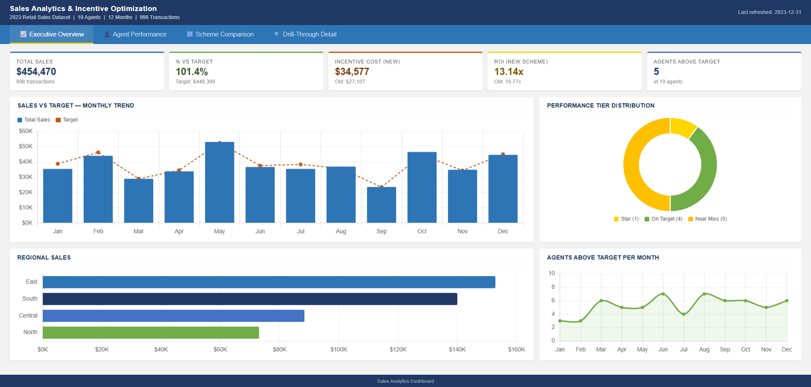
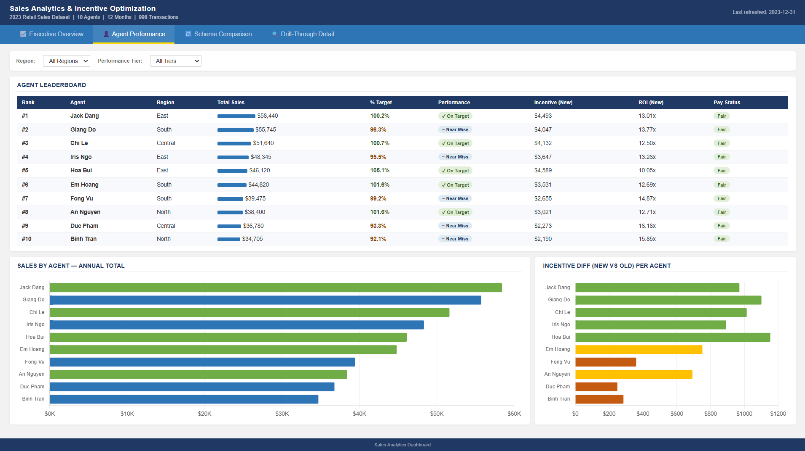
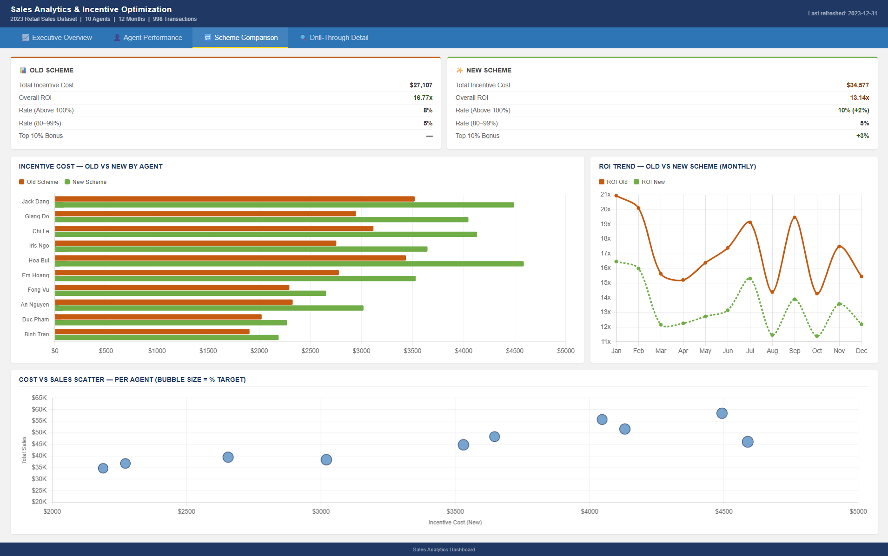
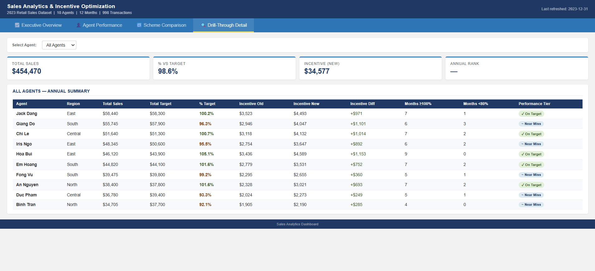

# 📊 Sales Analytics & Incentive Optimization System

> **A end-to-end Python pipeline that transforms raw retail transaction data into structured KPI reports, compares incentive compensation schemes, and exports Power BI-ready datasets — all in a single run.**

---

## 🗂️ Table of Contents

- [Overview](#overview)
- [Features](#features)
- [Project Structure](#project-structure)
- [Tech Stack](#tech-stack)
- [Getting Started](#getting-started)
- [Pipeline Walkthrough](#pipeline-walkthrough)
- [Incentive Scheme Logic](#incentive-scheme-logic)
- [Output Sheets](#output-sheets)
- [Dashboard Preview](#dashboard-preview)
- [Dataset](#dataset)
- [Author](#author)

---

## Overview

This project simulates a real-world **Sales Operations Analytics** workflow for a retail company with 10 sales agents across 4 regions. The pipeline ingests raw transaction data, assigns agents and regions, computes monthly KPIs, applies two competing incentive schemes, and exports a fully formatted Excel report ready for Power BI visualization.

**Key Business Questions Answered:**
- Which agents are hitting (or missing) their monthly targets?
- How does a performance-tiered incentive scheme compare to a flat-rate scheme in terms of ROI?
- Which regions are driving the most revenue?
- Who are the top performers each quarter?

---

## Features

- ✅ **Automated data cleaning** — filters to a clean 12-month window (2023), parses dates, and assigns months/quarters
- ✅ **Agent & region simulation** — randomly assigns 10 named agents across 4 regions with category specializations
- ✅ **Monthly target generation** — targets derived from actual sales with ±20% randomized variance
- ✅ **KPI computation** — calculates `% Target Achieved`, `Monthly Rank`, `Quarterly Rank`, and `YTD Sales` per agent
- ✅ **Dual incentive scheme comparison** — Old Scheme (flat 8%) vs New Scheme (tiered + Top 10% bonus)
- ✅ **ROI analysis** — compares incentive cost efficiency across both schemes
- ✅ **6-sheet Excel report** — professionally formatted with color-coded cells, alternating rows, and merged headers
- ✅ **Power BI-ready export** — raw data and KPI aggregations formatted for direct import

---

## Project Structure

```
Sales-Analytics-Incentive-Optimization-System/
│
├── sales_pipeline.py             # Main pipeline script
├── retail_sales_dataset.csv      # Raw input data (1,000 transactions)
├── sales_analytics_report.xlsx   # Generated output report
├── dashboard.html                # Interactive HTML dashboard
│
└── screenshots_dashboard/
    ├── overview.png
    ├── agent_performance.png
    ├── scheme_comparison.png
    └── drill_through_detail.png
```

---

## Tech Stack

| Tool | Purpose |
|------|---------|
| `Python 3.x` | Core pipeline language |
| `Pandas` | Data manipulation, groupby aggregations |
| `NumPy` | Statistical calculations, random target generation |
| `openpyxl` | Excel report generation with full formatting |

No external API keys or database connections required — runs fully offline.

---

## Getting Started

### Prerequisites

```bash
pip install pandas numpy openpyxl
```

### Run the Pipeline

```bash
git clone https://github.com/Khoi0703/Sales-Analytics-Incentive-Optimization-System.git
cd Sales-Analytics-Incentive-Optimization-System
python sales_pipeline.py
```

The script will print a live summary to your terminal and generate `sales_analytics_report.xlsx` in the same directory.

**Expected terminal output:**
```
📥 Loading data...
🧑‍💼 Assigning sales agents...
🎯 Generating monthly targets...
📊 Computing KPIs...
✅ Done! Saved: sales_analytics_report.xlsx

📊 Summary:
  Transactions processed : 1,000
  Agents tracked         : 10
  Months analyzed        : 12
  Total Sales            : ...
  Incentive Cost (Old)   : ...
  Incentive Cost (New)   : ...
  ROI Old Scheme         : ...x
  ROI New Scheme         : ...x
```

---

## Pipeline Walkthrough

The script runs through 6 sequential stages:

**Stage 1 — Load & Clean**
Reads `retail_sales_dataset.csv`, parses dates, filters to 2023, and derives `Month` and `Quarter` columns.

**Stage 2 — Agent Assignment**
Assigns 10 named agents to transactions (with seeded randomness for reproducibility). Each agent maps to a fixed Region and Product Category.

**Stage 3 — Target Generation**
Monthly targets are generated per agent by dividing their actual sales by a random factor (0.75–1.30), creating realistic over- and under-performance variance.

**Stage 4 — KPI Calculations**
Computes per-agent, per-month metrics: `Actual_Sales`, `Target`, `% Target`, `Monthly_Rank`, `Quarterly_Rank`, `YTD_Sales`, and incentive amounts under both schemes.

**Stage 5 — Scheme Comparison**
Aggregates the total incentive cost, ROI, and agent distribution between the Old and New schemes, producing a side-by-side comparison table.

**Stage 6 — Excel Export**
Writes 6 formatted sheets to `sales_analytics_report.xlsx` using `openpyxl`, with custom fonts, color fills, borders, and number formats.

---

## Incentive Scheme Logic

| Tier | % Target Achieved | Old Scheme | New Scheme | Notes |
|------|------------------|------------|------------|-------|
| Below Threshold | < 80% | 0% | 0% | No incentive paid |
| Standard | 80–99% | 5% | 5% | Same in both schemes |
| Above Target | ≥ 100% | 8% | 10% | +2% uplift in New Scheme |
| Top 10% Bonus | Any tier | — | +3% | Applied on top of base rate |

**Design Intent:** The New Scheme rewards high achievers more aggressively while keeping standard rates unchanged, aiming to improve ROI by concentrating incentive spend on top performers.

---

## Output Sheets

| Sheet | Contents |
|-------|----------|
| `Agent Summary` | Yearly KPI totals per agent — sales, targets, incentive costs, ROI |
| `Monthly KPI` | Full month-by-month breakdown per agent with ranks and incentive amounts |
| `Scheme Comparison` | Old vs New incentive scheme — cost, ROI, and verdict table |
| `Region Summary` | Aggregated performance by region (North / Central / South / East) |
| `Raw_Data_PBI` | Cleaned transaction-level data for Power BI import |
| `KPI_PBI_Export` | Monthly aggregated KPIs for Power BI measures and visuals |

---

## Dashboard Preview

| Overview | Agent Performance |
|----------|------------------|
|  |  |

| Scheme Comparison | Drill-Through Detail |
|------------------|----------------------|
|  |  |

---

## Dataset

`retail_sales_dataset.csv` — a publicly available retail transactions dataset containing:
- `Transaction ID`, `Date`, `Customer ID`, `Gender`, `Age`
- `Product Category`, `Quantity`, `Price per Unit`, `Total Amount`

Agent names, regions, and categories are **simulated and assigned** by the pipeline script — they are not present in the original CSV.

---

## Author

**Nguyen Dang Khoi**
